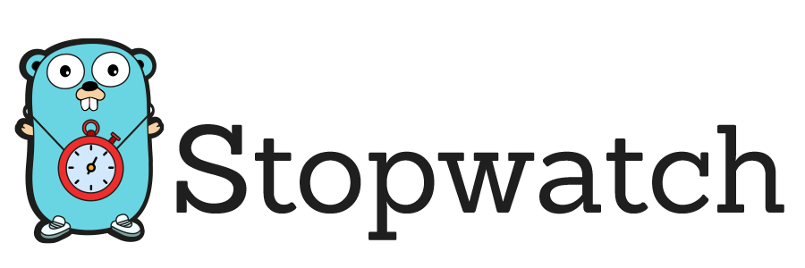

[](https://opensource.org/licenses/MIT)
[](https://goreportcard.com/report/github.com/inigolabs/stopwatch)
[](https://godoc.org/github.com/inigolabs/stopwatch)

## A simple utility tool to profile go code.

Profile timer that works like a stop watch, you start the timer and call the step function everytime you want to add a new data point. At the end you can print a summary of all the steps and the amount of time each step took.

Installation
------------
```shell
go get -u github.com/inigolabs/stopwatch
```

Usage
-----
```Go
func main() {
    timer := stopwatch.Start()

    doSomeStuff()
    timer.Step("doSomeStuff")
    doSomeMoreStuff()
    timer.Step("doSomeMoreStuff")
    doEvenMoreStuff()
    timer.Step("doEvenMoreStuff")

    timer.ShowResults()
}
```

The code above will print out a summary to stdout with the amount of time each step took.
```
doSomeStuff     : 2165.694534ms
doSomeMoreStuff : 11.568080ms
doEvenMoreStuff : 541.535541ms
-------------------------------
total           : 2718.798155ms
```

Middleware
----------
```Go
func main() {
    router := chi.NewRouter()
    router.Use(stopwatch.TimerMiddleware)
    router.Get("/", get)
    http.ListenAndServe(":80", router)
}

func get(w http.ResponseWriter, r *http.Request) {
    timer := stopwatch.TimerFromContext(r.Context())
    doSomeStuff()
    timer.Step("doSomeStuff")
    doSomeMoreStuff()
    timer.Step("doSomeMoreStuff")
    doEvenMoreStuff()
    timer.Step("doEvenMoreStuff")
}
```

### Noop Timer

Often, you'll want to leave the profile step function calls in the code and only run them in debug or profile mode. In this case you can use `Start()` when in debug mode, and otherwise instantiate the timer using `StartNoopTimer()`. 

License
-------
- [MIT License](LICENSE)

Happy Coding!
-------------


